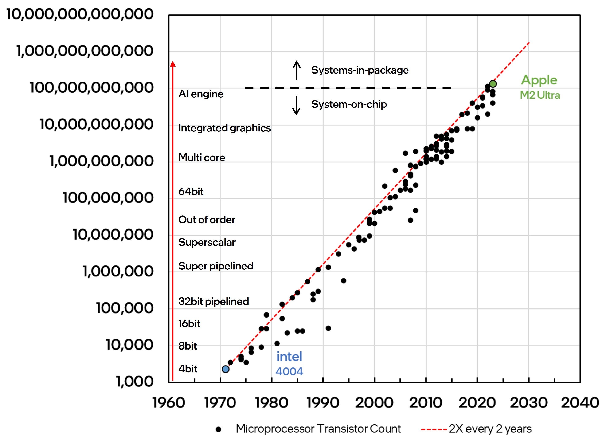

**M**AJOR **I**NNOVATIONS **I**N **C**OMPUTER **A**RCHITECTURE

#### This project reimplements key computer architecture innovations, first in Python, then in Verilog. See image.
---

  
Source: [The Relentless Pursuit of Moore's Law](https://semiconductor.substack.com/p/the-relentless-pursuit-of-moores-fcd)  
Watch Jim Keller's [AI Hardware Video](https://www.youtube.com/watch?v=lPX1H3jW8ZQ)

