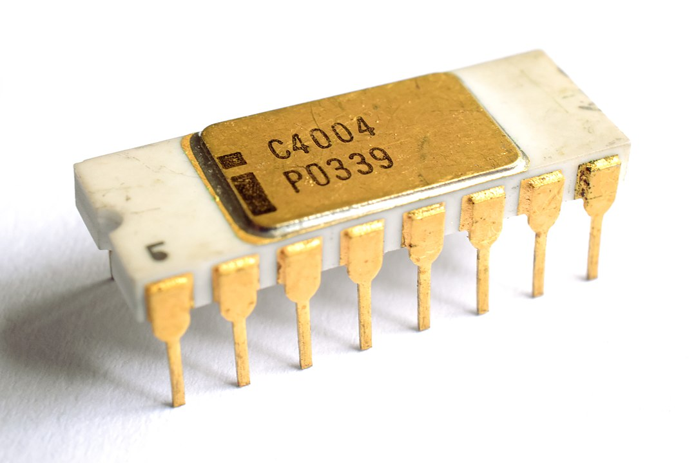
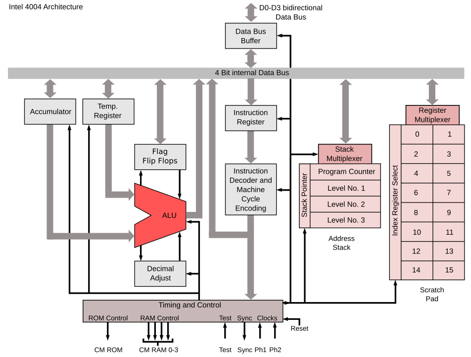
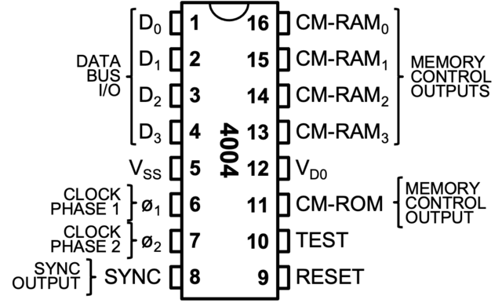

### The Intel 4004, released in 1971, was the first commercially produced processor. 

## Key Features

- **4-bit Processor**: Operates on 4-bit data units (nibbles), making it ideal for binary-coded decimal (BCD) arithmetic.
- **Clock Speed**: Runs at up to 740 kHz, with an instruction cycle of approximately 10.8 microseconds, executing ~92,000 instructions per second.
- **Instruction Set**: A BCD-oriented instruction set with 46 instructions, using an 8-bit instruction format.
- **Addressing**: Utilizes a 12-bit address bus, allowing access to up to 4 KB of ROM and 640 bytes of RAM.
- **Registers**: Includes sixteen 4-bit general-purpose registers grouped into pairs for addressing and operations.
- **Package**: Implemented in a 16-pin DIP package with multiplexed data and address lines to minimize pin count.

## Physical chip

## Architectural block diagram

## DIP chip pinout
